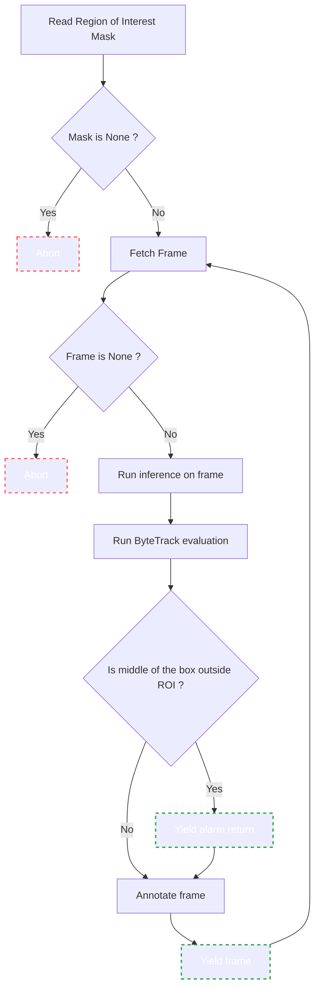

# State Diagram
## Man Overboard Computer Vision Detection Pipeline

```mermaid
flowchart TD
        A1[Read Region of Interest Mask]
        A1 --> A2

        A2{Mask is None ?}
        A2 --> |Yes| E1
        A2 --> |No| B1

        E1[Abort] 
        style E1 stroke:#f66,stroke-width:2px,color:#fff,stroke-dasharray: 5 5

        B1[Fetch Frame]
        B1 --> B2
        
        B2{Frame is None ?}
        B2 --> |Yes| E2
        B2 --> |No| C1

        C1[Run inference on frame]
        C1 --> C2

        C2[Run ByteTrack evaluation]
        C2 --> C3

        C3{Is middle of the box outside ROI ?}
        C3 --> |Yes| C4
        C3 --> |No| C5

        C4[Yield alarm return]
        C4 --> C5
        style C4 stroke:#28a745,stroke-width:2px,color:#fff,stroke-dasharray: 5 5

        C5[Annotate frame]
        C5 --> C6


        C6[Yield frame]
        C6 --> B1
        style C6 stroke:#28a745,stroke-width:2px,color:#fff,stroke-dasharray: 5 5

        E2[Abort]
        style E2 stroke:#f66,stroke-width:2px,color:#fff,stroke-dasharray: 5 5
```