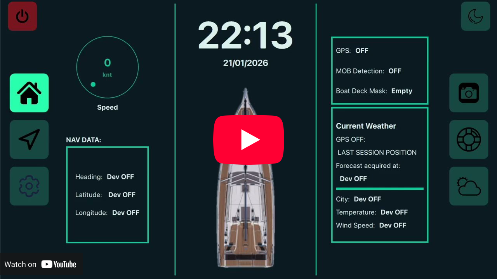

# Engineering Thesis
## A Navigation and Weather Device Enhancing the Safety of Amateur Inland Navigation

<div align="center">

[](https://pypi.org/project/PyQt5/)
[](https://github.com/ultralytics)
[](https://www.python.org)
[](https://github.com/komoot/staticmap)


[](https://github.com/AlexSzczygielski/navigation-and-weather-device-enhancing-the-safety-of-amateur-inland-navigation/actions/workflows/python-tests.yml)

</div>

### **"Navigare necesse est, vivere non est necesse"** - "Sailing is necessity, living is not." 
This old proverb
popularized by Plutarch and attributed to Pompeius Magnus is one of the most famous, time
proven, sayings between sailors. This simple expression reminds about the eternal danger that all
mariners have to face. As in sea going yachts the use of modern technology has become a standard in
the 21st century, the electronic devices adoption in inland water navigation is still very poor.

The main idea of this project is to challenge Pompey’s words and enhance sailing’s safety with the
help of modern electronics. The proposed solution is a portable device, that is low cost, open source and based on a single board computer. To achieve the defined objectives, following modules are implemented:

- **User - device communication** - a touchscreen with a `custom GUI` resembling the automotive infotainment systems.

- **Weather service** - module responsible for providing the `weather warnings and forecasts`.

- **Navigation service** - module utilizing the Global Navigation Satellite System (`GNSS`) to pro-
vide *current position* to the device system and display *heading, speed, etc*. Additionally a `map displaying current position` is shown.

- **Computer Vision Man Overboard Detection service** - this is a distinctive, experimental
feature, that **sets this project apart from other commercially available** solutions. This module is intended as a response to the most
dangerous problem sailors can encounter - a Man Overboard accident. This part of the
project aims to investigate and create a `computer vision pipeline` that is able to `detect a person falling overboard`.

The device is based on a *RaspberryPi* single board computer and utilizes several other modules -  a GSM/GPS hat with 4G cellular internet connection, 7 inch touchscreen, camera - all enclosed in a custom designed, 3D printed case. 

<a id="demo_video"></a>
<div align="center">
<a href="https://www.youtube.com/watch?v=0z96gya4NzE" target="_blank">

</div>

---

### The project consists of:

- Custom dedicated application with it's **frontend** built using `QML - a descriptive language framework` and **backend** implemented using a `Python and PyQt 5 framework`.

- Weather forecast and warnings data fetched using [OpenWeatherMap](https://openweathermap.org/) `weather API`,

- Current yacht's telemetry (position, speed, etc.) accessed using `GPS`,

- A custom **"Man Overboard Accident" detection system** based on `computer vision` solution,

- Day/Night mode with automatic switching,

- `Bash` automation and installation scripts,

- Complete [documentation](#documentation) with `UML diagrams` and installation tips,

- Github project management utilizing `categorized git issues` and `kanbans`,

- Github `testing`,

- ~~Cellular `4G` internet connection~~,

---

## Usage

### For RaspberryPi Deployment
0. Install a fresh [Raspberry Pi OS](https://www.raspberrypi.com/documentation/computers/getting-started.html#installing-the-operating-system)

1. Prepare python and it's virtual environment with required packages by running `setup_env_rpi.sh`.
```bash
chmod +x setup_env_rpi.sh
./setup_env_rpi.sh
```
> Please watch the installation process closely - it sometimes happens that one package does not install on the first run and requires re-running this script once again. *Installation might take up to few minutes*. For further explanation please refer to the [requirements installation section](docs/REQUIREMENTS.md#installation)

2. At first run use:
```bash
chmod +x compile.sh
./compile.sh
 ```
 > This script turns on the `venv` and prepares a `.qrc` file necessary to run the QML GUI. Though not necessary `./compile.sh` can also be run at every start of the application and should provide accurate operation.

 3. Every next run use:
 ```bash
source vevn/bin/activate
python main.py
 ```

 4. Weather Service activation

 To use weather service you need a API key from [Open Weather Map](https://openweathermap.org). The free account version is sufficient for this usage. Put this key into the `.env` file at the top directory. **Remember to keep this key secret!**

 *Example usage utilizing nano editor*:

 ```bash
touch .env
nano .env

OPEN_WEATHER_API_KEY=YOUR_KEY # Put in your key and save the file
 ```

> Put your private key inside .env. **Remember to name the constant variable exactly as in the example.**

### For Local Development
1. Prepare and activate a python virtual enviroment
```bash
python3 -m venv venv
source venv/bin/activate
```
> Note: *Python's virtual environment activation command might vary depending on the operating system*
2. Install python dependencies (**ensure you are in venv**)
```bash
pip install -r requirements.txt 
```

---

## Documentation:
### [Demonstration Video](#demo_video)
### [Project Requirements](docs/REQUIREMENTS.md)
### [Code Structure, Logic and UML Diagrams](docs/STRUCTURE_LOGIC_UML.md)
### [Usage](#usage)
### [Components Overview](#components-overview)
### [Project Structure](#project-structure)

---

## Components Overview:

The device consists of:
- [RaspberryPi 4B single-board computer](https://www.raspberrypi.com/products/raspberry-pi-4-model-b/)
- [GSM/GPS 4G HAT](https://www.waveshare.com/wiki/SIM7600E-H_4G_HAT)
- [7-inch touchscreen](https://www.waveshare.com/wiki/7inch_HDMI_LCD_%28C%29)
- [Camera](https://www.waveshare.com/wiki/RPi_Camera_%28G%29)
- Custom 3D printed enclosure

---

## Project Structure
```bash
navigation-and-weather-device-enhancing-the-safety-of-amateur-inland-navigation % tree -L1
.
├── app/ # Python application code
├── assets/ # Static GUI resources
├── components/ # Reusable QML components
├── cv/ # CV pipelines and logic
├── data/ # Demo datasets/data
├── docs/ # Documentation
├── gnss_module/ # GNSS module code
├── models/ # ML weights
├── sys_conf_files/ # Script files for system daemons
├── tests/ # Unit tests
├── views/ # QML GUI
├── weather_module/ # Weather Module Code
├── main.py # Application entry point
├── main.qml # Main QML UI file
├── qml.qrc # QML Resources
├── qml.qrc # QML Style Configuration
├── config.py # Global project configuration
├── compile.sh # QRC dependency compilation file
└── setup_env_rpi.sh # Setup script for RPi
```

---
<div align="center">
<a href="https://www.agh.edu.pl" target="_blank">

<a href="https://iet.agh.edu.pl" target="_blank">

</div>

