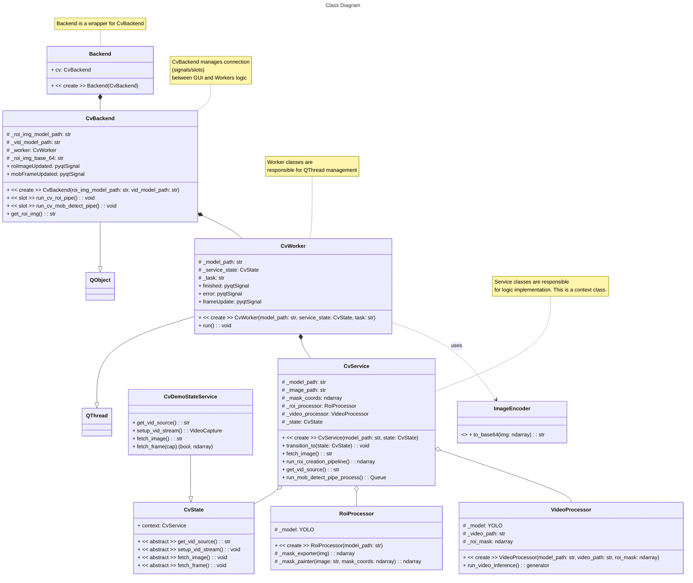

# Updated for commit [`4b29971`](https://github.com/AlexSzczygielski/navigation-and-weather-device-enhancing-the-safety-of-amateur-inland-navigation/tree/4b299714e3c6331925caa291a1c8c346e9ebbbfe)

```mermaid
---
title: Class Diagram
---

classDiagram
    note for Backend "Backend is a wrapper for CvBackend"
    class Backend {
        + cv: CvBackend
        + << create >> Backend(CvBackend)
    }

    note for CvBackend "CvBackend manages connection
    (signals/slots)
    between GUI and Workers logic"
    class CvBackend {
        # _roi_img_model_path: str
        # _vid_model_path: str
        # _worker: CvWorker
        # _roi_img_base_64: str
        + roiImageUpdated: pyqtSignal
        + mobFrameUpdated: pyqtSignal
        + << create >> CvBackend(roi_img_model_path: str, vid_model_path: str)
        + << slot >> run_cv_roi_pipe(): void
        + << slot >> run_cv_mob_detect_pipe(): void
        + get_roi_img(): str
    }

    note for CvWorker "Worker classes are 
    responsible for QThread management"
    class CvWorker {
        # _model_path: str
        # _service_state: CvState
        # _task: str
        + finished: pyqtSignal
        + error: pyqtSignal
        + frameUpdate: pyqtSignal
        + << create >> CvWorker(model_path: str, service_state: CvState, task: str)
        + run(): void
    }

    note for CvService "Service classes are responsible 
    for logic implementation. This is a context class."
    class CvService {
        # _model_path: str
        # _image_path: str
        # _mask_coords: ndarray
        # _roi_processor: RoiProcessor
        # _video_processor: VideoProcessor
        # _state: CvState
        + << create >> CvService(model_path: str, state: CvState)
        + transition_to(state: CvState): void
        + fetch_image(): str
        + run_roi_creation_pipeline(): ndarray
        + get_vid_source(): str
        + run_mob_detect_pipe_process(): Queue
    }

    class CvState {
        + context: CvService
        + << abstract >> get_vid_source(): str
        + << abstract >> setup_vid_stream(): void
        + << abstract >> fetch_image(): void
        + << abstract >> fetch_frame(): void
    }

    class CvDemoStateService {
        + get_vid_source(): str
        + setup_vid_stream(): VideoCapture
        + fetch_image(): str
        + fetch_frame(cap): (bool, ndarray)
    }

    class RoiProcessor {
        # _model: YOLO
        + << create >> RoiProcessor(model_path: str)
        # _mask_exporter(img): ndarray
        # _mask_painter(image: str, mask_coords: ndarray): ndarray
    }

    class VideoProcessor {
        # _model: YOLO
        # _video_path: str
        # _roi_mask: ndarray
        + << create >> VideoProcessor(model_path: str, video_path: str, roi_mask: ndarray)
        + run_video_inference(): generator
    }

    class ImageEncoder {
        <<static>> + to_base64(img: ndarray): str
    }

    Backend *-- CvBackend
    CvBackend --|> QObject
    CvBackend *-- CvWorker
    CvWorker --|> QThread
    CvWorker *-- CvService
    CvWorker ..> ImageEncoder : uses
    CvService o-- CvState
    CvService o-- RoiProcessor
    CvService o-- VideoProcessor
    CvDemoStateService --|> CvState
```
